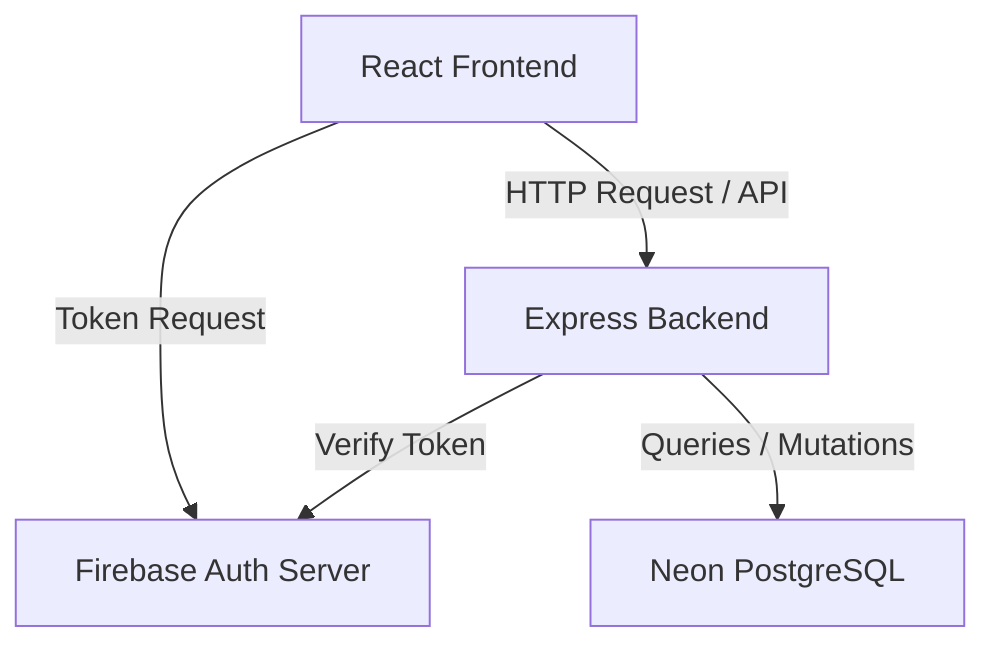
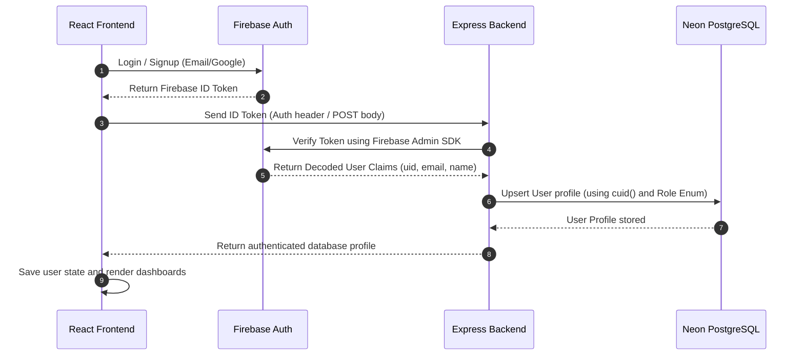

# System Architecture: PlayMate

This document outlines the technical design, stack, and flows for the PlayMate project.

## 🏗️ Overall Architecture

PlayMate is structured as a decoupled Client-Server architecture. The frontend React application communicates with the Node.js Express backend service via API requests.



---

## 💻 Technology Stack

### Frontend
- **Framework:** React (Vite, TypeScript)
- **Styling:** Tailwind CSS
- **State & Data Fetching:** React Query
- **Authentication:** Firebase Client SDK

### Backend
- **Framework:** Node.js, Express, TypeScript (configured for ES Modules)
- **Database:** Neon PostgreSQL (Cloud-based PostgreSQL)
- **ORM:** Prisma
- **Auth Verification:** Firebase Admin SDK

---

## 🔑 Authentication Flow

All authentication state is managed securely. Firebase handles sign-in credential verification, and Neon PostgreSQL serves as the primary application source of truth.



---

## 📁 Directory Structure

```text
Playmate/
├── backend/
│   ├── prisma/
│   │   └── schema.prisma      # Prisma configuration and database models
│   ├── src/
│   │   ├── config/
│   │   │   ├── db.ts          # Prisma Client setup
│   │   │   └── firebase.ts    # Firebase Admin SDK setup
│   │   ├── controllers/
│   │   │   ├── auth.controller.ts
│   │   │   └── user.controller.ts
│   │   ├── middleware/
│   │   │   └── auth.middleware.ts  # Token validation middleware
│   │   ├── routes/
│   │   │   ├── auth.routes.ts
│   │   │   └── user.routes.ts
│   │   ├── services/
│   │   │   ├── auth.service.ts
│   │   │   └── user.service.ts
│   │   ├── app.ts             # Express app setup
│   │   └── server.ts          # Server entry point
│   ├── package.json
│   └── tsconfig.json
├── src/                       # Frontend Source Directory
│   ├── config/
│   │   └── firebase.ts        # Firebase Client SDK
│   ├── contexts/
│   │   ├── AuthContext.tsx    # Session & token management
│   │   └── RoleContext.tsx    # Active UI role management
│   ├── services/
│   │   ├── api.ts             # Axios client with interceptors
│   │   ├── auth.service.ts
│   │   └── user.service.ts
│   └── App.tsx
```
